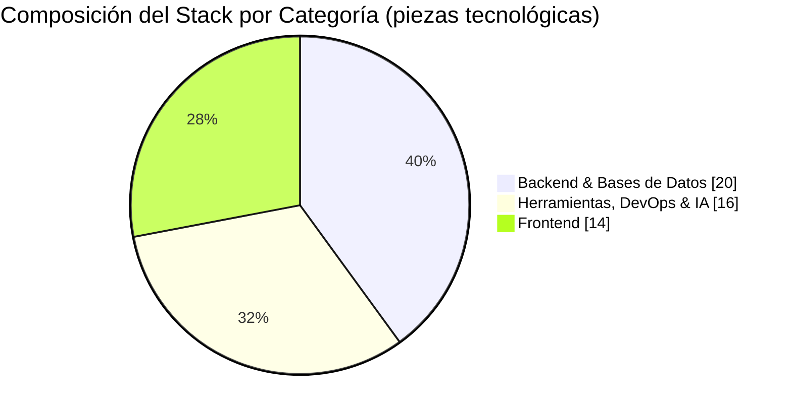
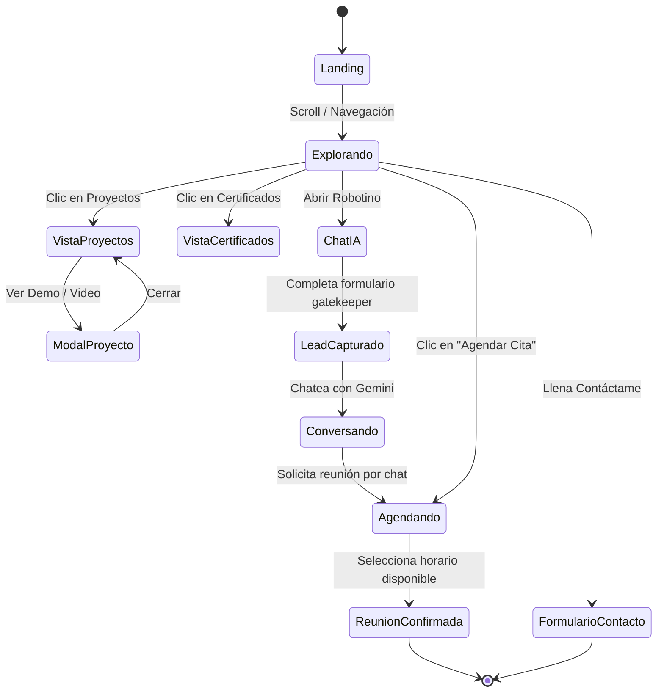
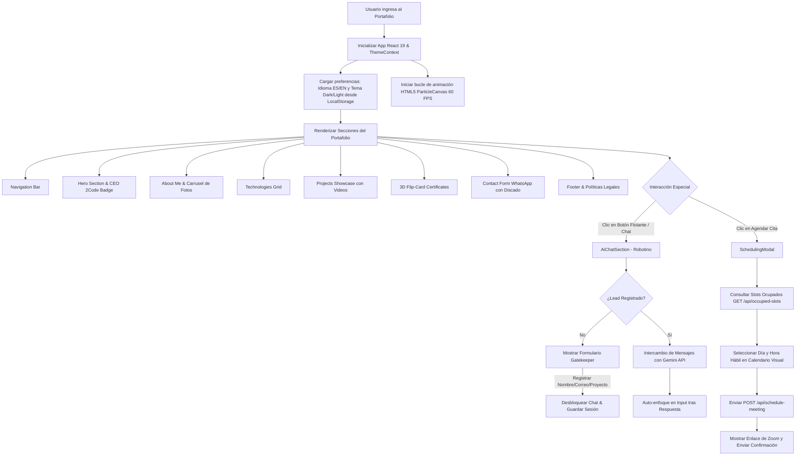
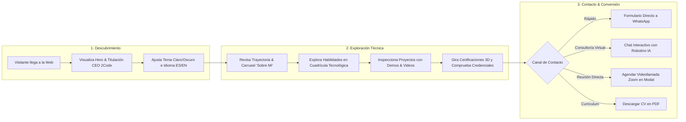
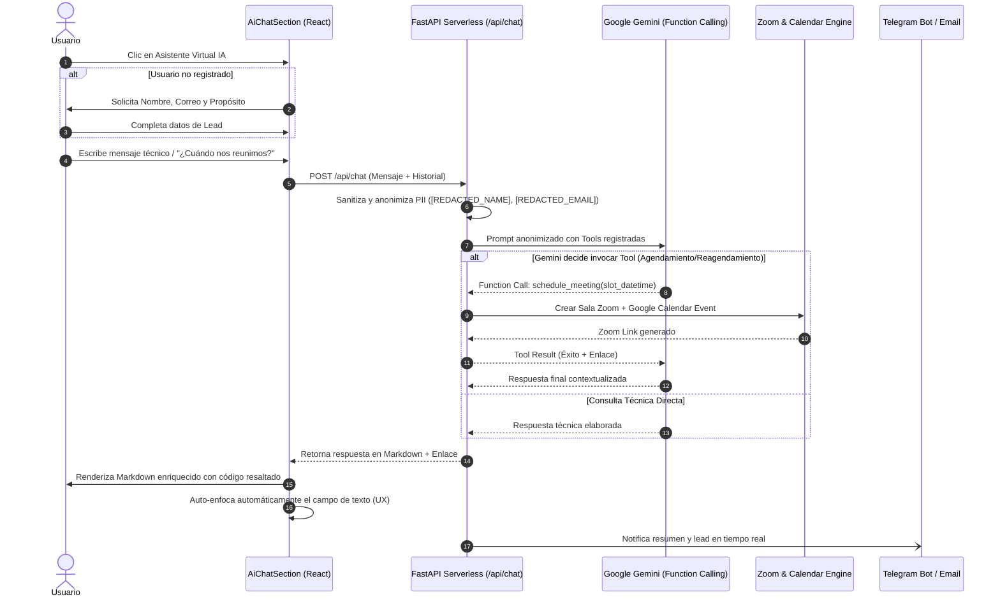
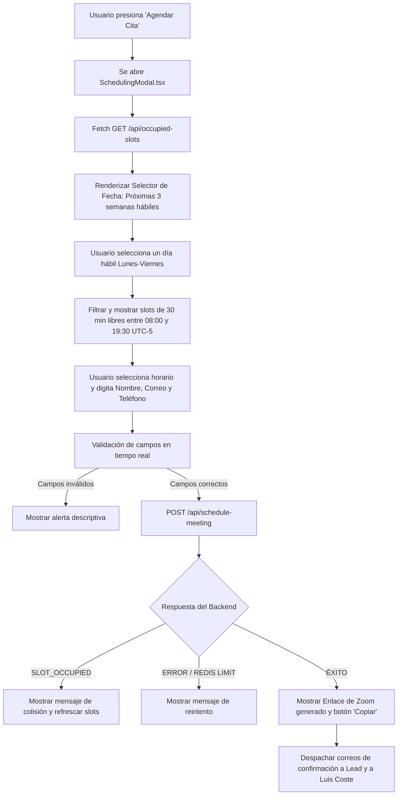

# 🚀 Portafolio Web Interactivo de Ingeniería & Desarrollo Full-Stack
### **Luis Fernando Coste Contreras (LFCC)**


Este repositorio contiene la plataforma web personal e interactiva de **Luis Fernando Coste Contreras (LFCC)**, un espacio digital de alto rendimiento diseñado y desarrollado bajo arquitectura **Single Page Application (SPA)** con **React 19**, **TypeScript**, **Tailwind CSS v4**, **Motion** (`motion/react`) e integración con **Inteligencia Artificial (Google Gemini API / FastAPI)**.

La plataforma ofrece una experiencia inmersiva bajo la estética **Crystal Glassmorphism**, un motor de partículas estelares en tiempo real en HTML5 Canvas (60 FPS en desktop y móvil), internacionalización nativa en dos idiomas (**Español** e **Inglés**), un consultor técnico virtual con IA (**Robotino**), sistema de agendamiento de videollamadas con **Zoom** y **Google Calendar**, y un gestor completo de privacidad y cumplimiento legal.

---

## 📋 Tabla de Contenidos

- [👨‍💻 Perfil Profesional](#-perfil-profesional)
- [🌐 Enlaces Oficiales y Contacto](#-enlaces-oficiales-y-contacto)
- [🛠️ Stack Tecnológico Completo](#️-stack-tecnológico-completo)
- [📈 Gráficas del Stack y Patrón de Uso](#-gráficas-del-stack-y-patrón-de-uso)
- [📊 Diagramas de Flujo del Sistema](#-diagramas-de-flujo-del-sistema)
- [🗺️ Diagramas de Flujo y Experiencia de Usuario](#️-diagramas-de-flujo-y-experiencia-de-usuario)
- [🚀 Catálogo de Proyectos y Casos de Estudio](#-catálogo-de-proyectos-y-casos-de-estudio)
- [📜 Certificaciones y Credenciales Académicas](#-certificaciones-y-credenciales-académicas)
- [🤖 Consultor Técnico Virtual con IA & Agendamiento](#-consultor-técnico-virtual-con-ia--agendamiento)
- [⚖️ Políticas Legales, Privacidad y Cookies](#️-políticas-legales-privacidad-y-cookies)
- [🌟 Componentes e Infraestructura Frontend](#-componentes-e-infraestructura-frontend)
- [📁 Estructura del Proyecto](#-estructura-del-proyecto)
- [⚡ Estrategias de Optimización y UX](#-estrategias-de-optimización-y-ux)
- [💻 Guía de Instalación y Ejecución Local](#-guía-de-instalación-y-ejecución-local)

---

## 👨‍💻 Perfil Profesional

### **Luis Fernando Coste Contreras**
**Desarrollador de Software a la Medida, Creador de Software & Arquitecto Full-Stack**

Apasionado por el diseño de arquitecturas eficientes, el código limpio (*Clean Code*) y la construcción de sistemas escalables de alta disponibilidad. Combina la rigurosidad lógica de la arquitectura Backend (diseño de APIs RESTful robustas, optimización de bases de datos relacionales y distribuidas, e integración de comunicaciones en tiempo real) con la versatilidad interactiva del Frontend moderno.

> *"Mi perspectiva integral del desarrollo me permite coordinar cada fase del ciclo de vida del software con precisión técnica, traduciendo requerimientos complejos de negocio en soluciones digitales estables, seguras y de alto rendimiento."*

* **Filosofía:** Separación de conceptos (*Decoupled / SoC*), tipado estricto, desarrollo guiado por rendimiento y aprendizaje continuo.
* **Sede Principal:** Colombia 🇨🇴
* **Marca Corporativa:** Fundador & CEO en **2Code** ([2code.com.co](https://2code.com.co/)).

---

## 🌐 Enlaces Oficiales y Contacto

- 💼 **LinkedIn:** [linkedin.com/in/luisfcostec](https://linkedin.com/in/luisfcostec)
- 🐙 **GitHub:** [github.com/LuisFCosteC](https://github.com/LuisFCosteC)
- 🏢 **Empresa:** [2code.com.co](https://2code.com.co/)
- 📧 **Correo Electrónico:** [luisfcostec@gmail.com](mailto:luisfcostec@gmail.com)
- 💬 **WhatsApp Directo:** [+57 304 204 2752](https://wa.me/+573042042752)
- 🎮 **Discord:** [luisfcostec](https://discord.com/users/luisfcostec)
- 📄 **Descarga de CV (Español):** [Curriculum_Luis_Fernando_Coste_Contreras_ES.pdf](file:///d:/PROGRAMACION/Next.js/lfcc-portafolio/public/docs/Curriculum_Luis_Fernando_Coste_Contreras_ES.pdf)
- 📄 **Descarga de CV (Inglés):** [Curriculum_Luis_Fernando_Coste_Contreras_EN.pdf](file:///d:/PROGRAMACION/Next.js/lfcc-portafolio/public/docs/Curriculum_Luis_Fernando_Coste_Contreras_EN.pdf)

---

## 🛠️ Stack Tecnológico Completo

El dominio técnico de Luis Coste abarca tres categorías principales presentadas de forma interactiva en la plataforma:

### 1. 🎨 Frontend
- **Frameworks & Librerías:** React 19, Next.js (App Router, SSR, SSG), Angular.
- **Lenguajes & Estilos:** TypeScript 5.8, JavaScript (ES6+), HTML5 Semántico, CSS3 Moderno, Tailwind CSS v4, Bootstrap, shadcn/ui.
- **Empaquetadores & Animaciones:** Vite 6, Motion (`motion/react` 12), Lucide Icons, Embla Carousel.

### 2. ⚙️ Backend & Bases de Datos
- **Lenguajes de Programación:** Python, Java, C#, Node.js, JavaScript.
- **Frameworks Backend:** FastAPI, Express.js, ASP.NET Core, .NET.
- **Comunicación & Tiempo Real:** WebSockets (`socket.io`), APIs RESTful, Middleware CORS, JSON Web Tokens.
- **Bases de Datos & ORMs:** MySQL, Microsoft SQL Server, PostgreSQL, Turso (libSQL) / SQLite, Upstash Redis, Entity Framework Core, Prisma.

### 3. 🛠️ Herramientas, Entornos, Videollamadas e IA
- **Control de Versiones & DevOps:** Git, GitHub, Git Bash, Docker, Vercel, Render.
- **Videoconferencias:** Zoom API (Server-to-Server OAuth), Google Calendar API v3.
- **Pruebas & Herramientas:** Postman, Swagger / OpenAPI, Figma.
- **Integración de Inteligencia Artificial:** Google Gemini API, Genkit AI, Claude AI, Google AI Studio, Antigravity.

---

## 📈 Gráficas del Stack y Patrón de Uso

### 1. Distribución del Stack Tecnológico



### 2. Patrón de Uso Típico de un Visitante (Diagrama de Estados)



---

## 📊 Diagramas de Flujo del Sistema

### 1. Arquitectura General y Flujo de Estados del Frontend



---

## 🗺️ Diagramas de Flujo y Experiencia de Usuario

### 1. Flujo de Navegación y Descubrimiento de Contenido (User Journey)



### 2. Flujo de Interacción con el Asistente IA ("Robotino")



### 3. Flujo del Modal de Agendamiento Visual (`SchedulingModal.tsx`)



---

## 🚀 Catálogo de Proyectos y Casos de Estudio

El portafolio incluye 7 proyectos destacados desarrollados con estándares profesionales, cada uno documentado con rol, especificaciones técnicas, galerías y videos interactivos:

| # | Proyecto | Categoría / Stack | Descripción y Logros Técnicos | Enlaces |
|---|---|---|---|---|
| **7** | **Plataforma Corporativa 2Code** | `Next.js` `TypeScript` `React` `Tailwind CSS` `shadcn` `Node.js` | Firma de consultoría tecnológica especializada en arquitectura a la medida y automatización. Incluye captación de leads, sistema de agendamiento y SEO optimizado. | 🌐 [Demo](https://2code.com.co/) / 🐙 [GitHub](https://github.com/LuisFCosteC) |
| **6** | **EcoKraft Solutions** | `Next.js 15` `TypeScript` `React` `Tailwind CSS` `Genkit AI` | Plataforma de empaque sostenible con estética industrial de lujo. Implementa arquitectura híbrida (SSR/SSG), automatización por IA en el servidor (Genkit) y componentes accesibles (WAI-ARIA). | 🌐 [Demo](https://ecokraf.vercel.app/) |
| **5** | **Sistema ERP de Ventas e Inventario** | `Angular` `.NET Core` `SQL Server` | ERP empresarial desacoplado (SoC). Backend en capas (API, BLL, DAL, DTO) con Entity Framework Core. Frontend modular en Angular con Lazy Loading y gráficos interactivos. | 🐙 [GitHub](https://github.com/LuisFCosteC/Sales_Management_System) |
| **4** | **Sistema Transaccional en Tiempo Real** | `Node.js` `JavaScript` `Socket.io` `LibSQL/SQLite` | Infraestructura full-duplex sobre WebSockets y servidor Express en ESM. Procesa eventos inmediatos y realiza auditoría atómica de conexiones con LibSQL embebido. | 🐙 [GitHub](https://github.com/LuisFCosteC/LuisFCosteC-WebSocket_Project_Client-Server_Communication) |
| **3** | **Pokédex Asíncrono (BFF)** | `FastAPI` `Python` `HTML5` `CSS3` `JS` | Backend-for-Frontend (BFF) en Python para procesamiento concurrente asíncrono hacia APIs externas. Incluye validación de esquemas OpenAPI y pruebas unitarias. | 🐙 [GitHub](https://github.com/LuisFCosteC/Pokedex-API-Project) |
| **2** | **Sistema de Gestión de Empleados** | `React` `Bootstrap` `Node.js` `MySQL` `Axios` | Aplicación SPA desacoplada con API RESTful sobre Node/Express. Persistencia relacional normalizada en MySQL con mitigación de inyección SQL y alertas interactivas. | 🐙 [GitHub](https://github.com/LuisFCosteC/Form-with-React-MySql-NodeJs-Bootstrap) |
| **1** | **Explorador Rick & Morty** | `React` `HTML5` `CSS3` `JavaScript` | Aplicación web dinámica consumiendo la API pública de Rick & Morty. Estado global reactivo con Hooks, paginación optimizada y maquetación adaptativa fluida. | 🐙 [GitHub](https://github.com/LuisFCosteC/Rick-and-Morty-Api-with-React/tree/main) |

---

## 📜 Certificaciones y Credenciales Académicas

Luis Coste respalda su conocimiento con **14 certificaciones internacionales** verificables, desplegadas en la web mediante un carrusel 3D con tarjetas giratorias e interactivas:

1. 📱 **Introducción al desarrollo de apps móviles para Android** — *Meta (Coursera)* | May 2025 | [Verificar](https://coursera.org/share/0ecfa4c415c7b22a3a6ef16c2ff10987)
2. ⚡ **Fundamentos de JavaScript 1** — *Cisco Networking Academy* | Ene 2024 | [Verificar](https://www.credly.com/badges/c7cc4845-32fa-43da-a558-ab7425f429a1/public_url)
3. 📊 **Introducción a la ciencia de datos** — *Cisco Networking Academy* | Oct 2023 | [Verificar](https://www.credly.com/badges/f52ebc92-b2f4-4502-91d4-0c4c270e9868/public_url)
4. 🐍 **Fundamentos de Python 1** — *Cisco Networking Academy* | Oct 2023 | [Verificar](https://www.credly.com/badges/e16fc1f1-07a8-492e-824b-a716a05b7506/public_url)
5. 💻 **C# TOTAL - Programador Experto en 28 días** — *Udemy* | Jun 2023 | [Verificar](https://www.udemy.com/certificate/UC-1c303618-7f7e-4b8a-bbd8-67adebf3f653/)
6. 🎯 **Fundamentos esenciales de la programación** — *LinkedIn Learning* | Jun 2023 | [Verificar](https://www.linkedin.com/learning/certificates/9a0be56003c2f431a17b128ae833e4fbda32b23b2eb954ed4de3bd4492e8fa5e)
7. 🚀 **Fundamentos profesionales del desarrollo de software** — *Microsoft & LinkedIn* | Jun 2023 | [Verificar](https://www.linkedin.com/learning/certificates/2c010a994a0f9e236f9c70ce37e31324933bb42f7e874f42f9d602451abe6b23)
8. 📈 **Fundamentos profesionales del análisis de datos** — *Microsoft & LinkedIn* | Jun 2023 | [Verificar](https://www.linkedin.com/learning/certificates/9806fbfe500721a7a81d42c927e18ab977f1a470ddf94997642f15afc29b70a9)
9. 🔍 **Aprende análisis de datos** — *LinkedIn Learning* | Jun 2023 | [Verificar](https://www.linkedin.com/learning/certificates/73018c00c9f51d274c36e5cb49703ff02b1dd0cc787d6587c1a776719780c059)
10. 🧬 **Aprende data science: Conceptos básicos** — *LinkedIn Learning* | Jun 2023 | [Verificar](https://www.linkedin.com/learning/certificates/9cae73169f4170d2714bc9e4a0a84b40dc3a8e46dab24a4d70e66fc3e6509775)
11. 🗣️ **Aprende data science: Cuenta historias con los datos** — *LinkedIn Learning* | Jun 2023 | [Verificar](https://www.linkedin.com/learning/certificates/fc69c9a37d0cfa199314677ab8e194b0599eb0dcb816ca27f5625d6a143dcf1f)
12. 🎓 **Introducción a las habilidades profesionales en análisis de datos** — *LinkedIn Learning* | Jun 2023 | [Verificar](https://www.linkedin.com/learning/certificates/bf4c916cd2804b1b312ad7ce42b220913c284317bf8e87fb43ad53542024adb7)
13. 🗄️ **Aprende SQL con MySQL 8** — *Udemy* | Jun 2023 | [Verificar](https://www.udemy.com/certificate/UC-d3c2f565-ec45-446e-9c1f-a8e86e80ca30/)
14. 📊 **Excel Intermedio** — *Compensar & EDU* | Jun 2023 | [Ver Documento](file:///d:/PROGRAMACION/Next.js/lfcc-portafolio/public/docs/Certificado_Excel_intermedio.pdf)

---

## 🤖 Consultor Técnico Virtual con IA & Agendamiento

La aplicación cuenta con un ecosistema interactivo potenciado por **Robotino**, un asistente técnico guiado por la API de **Google Gemini** a través de un backend Serverless en **FastAPI** (desplegado en **Vercel**):

- **Gatekeeper de Captura (Leads):** Formulario previo para registrar Nombre, Correo e Idea de Proyecto antes de habilitar el chat.
- **Anonimización PII en Tiempo Real:** El backend sanitiza nombres y correos reemplazándolos por tokens genéricos (`[REDACTED_NAME]`, `[REDACTED_EMAIL]`) antes de consultar el modelo de IA.
- **Agendamiento y Reagendamiento Inteligente (`SchedulingModal.tsx` & Gemini Function Calling):**
  - Permite agendar videollamadas de 30 minutos de forma interactiva seleccionando días y horas hábiles en un selector visual de bloques disponibles.
  - Soporte conversacional para consultar el estado de la cita (`get_my_scheduled_meeting`), agendar (`schedule_meeting`) y reagendar (`reschedule_meeting`) cancelando automáticamente el evento anterior en Google Calendar y Zoom sin dejar duplicados.
- **Experiencia de Usuario Fluida (UX):** Auto-enfoque inteligente del campo de texto (`chatInputRef`) al finalizar cada turno de respuesta de la IA, permitiendo una interacción ágil sin clics redundantes.
- **Parser de Markdown Personalizado:** Formatea respuestas con bloques de código resaltados, listas anidadas, viñetas y texto enriquecido.
- **Conexión Dinámica de Backend (`getApiUrl`):** Detecta dinámicamente el entorno de ejecución (`VITE_API_BASE_URL` apuntando a la Serverless Function en producción o `localhost:8000` en desarrollo local).
- **Notificaciones y Auditoría Automáticas:** Al finalizar o agendar, el backend notifica de inmediato al bot de Telegram y confirma la cita por correo electrónico vía SMTP TLS.

---

## ⚖️ Políticas Legales, Privacidad y Cookies

El portafolio incluye una infraestructura completa de cumplimiento legal accesible desde el pie de página (`Footer.tsx`):

1. 🛡️ **Tratamiento de Datos Personales (Ley 1581 de 2012 - Colombia):** Regula la recolección confidencial de datos personales para la formulación de propuestas comerciales y el ejercicio de derechos ARCO (Acceso, Rectificación, Cancelación y Oposición).
2. 🔒 **Política de Privacidad:** Detalla que los datos personales se cifran en reposo con AES-GCM/Fernet, no se comparten con terceros ni con proveedores de IA en texto plano y no se almacenan permanentemente sin consentimiento.
3. 🍪 **Política de Cookies & Consola de Configuración:**
   - **Cookies Esenciales:** Persisten tema (Claro/Oscuro) e idioma (`lfcc-portfolio-lang`). Obligatorias.
   - **Cookies Analíticas & Marketing:** Configurables por el usuario desde el banner interactivo superior/inferior o desde el panel de preferencias.
4. 📄 **Términos y Condiciones:** Protege la propiedad intelectual de los desarrollos, códigos y marcas exhibidas.

---

## 🌟 Componentes e Infraestructura Frontend

| Componente | Archivo | Descripción Técnica |
|---|---|---|
| **Canvas Celestial** | [ParticleCanvas.tsx](file:///d:/PROGRAMACION/Next.js/lfcc-portafolio/src/components/ParticleCanvas.tsx) | Motor de render en HTML5 Canvas con constelaciones titilantes y meteoros fugaces. Reduce en 70% los cálculos en dispositivos móviles para sostener **60 FPS**. |
| **Navegación** | [Navigation.tsx](file:///d:/PROGRAMACION/Next.js/lfcc-portafolio/src/components/Navigation.tsx) | Menú responsive con telón translúcido (`backdrop-blur-md bg-[#01060c]/96`), selector de idioma (ES/EN) e interruptor de Tema. |
| **Hero** | [Hero.tsx](file:///d:/PROGRAMACION/Next.js/lfcc-portafolio/src/components/Hero.tsx) | Bienvenida principal con blobs de luz orbitantes, titulación de CEO de 2Code y animaciones escalonadas de Motion. |
| **Sobre Mí** | [AboutMe.tsx](file:///d:/PROGRAMACION/Next.js/lfcc-portafolio/src/components/AboutMe.tsx) | Biografía narrativa integrada con un carrusel interactivo de imágenes profesionales (`embla-carousel-react`). |
| **Tecnologías** | [Technologies.tsx](file:///d:/PROGRAMACION/Next.js/lfcc-portafolio/src/components/Technologies.tsx) | Cuadrícula interactiva clasificada por categorías (Frontend, Backend, Herramientas) con iluminación dinámica hover. |
| **Proyectos** | [Projects.tsx](file:///d:/PROGRAMACION/Next.js/lfcc-portafolio/src/components/Projects.tsx) | Galería filtrable con transiciones fluidas (`AnimatePresence`) y modales adaptativos con videos y especificaciones completas. |
| **Certificados** | [Certificates.tsx](file:///d:/PROGRAMACION/Next.js/lfcc-portafolio/src/components/Certificates.tsx) | Carrusel 3D con tarjetas volteables (*Flip Card*), sellos holográficos y modal interactivo de previsualización. |
| **Contacto** | [ContactForm.tsx](file:///d:/PROGRAMACION/Next.js/lfcc-portafolio/src/components/ContactForm.tsx) | Formulario con validación en tiempo real, selector adaptativo de indicativo de país y generador directo de mensajes para WhatsApp. |
| **Modal Agendamiento** | [SchedulingModal.tsx](file:///d:/PROGRAMACION/Next.js/lfcc-portafolio/src/components/SchedulingModal.tsx) | Modal interactivo para selección visual de fecha y slots de 30 minutos conectados con Google Calendar y Zoom. |
| **Asistente IA** | [AiChatSection.tsx](file:///d:/PROGRAMACION/Next.js/lfcc-portafolio/src/components/AiChatSection.tsx) | Consultor técnico virtual interactivo con soporte de streaming/markdown, auto-enfoque tras respuesta y agendamiento por lenguaje natural. |
| **Footer & Legales** | [Footer.tsx](file:///d:/PROGRAMACION/Next.js/lfcc-portafolio/src/components/Footer.tsx) | Modales de políticas legales (Ley 1581), banner de consentimiento de cookies y enlaces a redes sociales oficiales. |
| **Atajos Flotantes** | [FloatingButtons.tsx](file:///d:/PROGRAMACION/Next.js/lfcc-portafolio/src/components/FloatingButtons.tsx) | Botones de acceso rápido a WhatsApp, Gmail y Agendamiento de citas con disparadores sincronizados. |

---

## 📁 Estructura del Proyecto

```bash
lfcc-portafolio/
├── public/
│   ├── docs/                    # Documentos PDF (Certificados, CVs)
│   ├── images/                  # Capturas de proyectos, insignias y fotos
│   └── videos/                  # Demostraciones en video de proyectos
├── src/
│   ├── App.tsx                  # Componente raíz y orquestación de secciones
│   ├── main.tsx                 # Punto de entrada de React 19
│   ├── index.css                # Estilos globales y variables Tailwind v4 (Crystal Glassmorphism)
│   ├── types.ts                 # Declaraciones y tipos globales TypeScript
│   ├── components/              # Componentes de UI modulares y reactivos
│   │   ├── Navigation.tsx       # Barra de navegación e i18n
│   │   ├── Hero.tsx             # Sección de presentación principal
│   │   ├── AboutMe.tsx          # Historia personal y carrusel de fotos
│   │   ├── Technologies.tsx     # Stack de habilidades técnicas
│   │   ├── Projects.tsx         # Galería de casos de estudio y videos
│   │   ├── Certificates.tsx     # Carrusel de certificaciones 3D
│   │   ├── ContactForm.tsx      # Formulario para WhatsApp con indicativos
│   │   ├── SchedulingModal.tsx  # Modal de agendamiento de reuniones con Calendar y Zoom
│   │   ├── Footer.tsx           # Pie de página, cookies y políticas legales
│   │   ├── FloatingButtons.tsx  # Atajos directos de contacto y agendamiento
│   │   ├── AiChatSection.tsx    # Consultor virtual con Gemini AI
│   │   ├── CVButton.tsx         # Botón de descarga de CV
│   │   └── ParticleCanvas.tsx   # Canvas dinámico de constelaciones
│   ├── context/                 # Contextos globales de React
│   │   └── ThemeContext.tsx     # Manejo de tema Claro / Oscuro
│   ├── i18n/                    # Módulos de traducción internacional
│   │   ├── es.ts                # Diccionario en Español
│   │   ├── en.ts                # Diccionario en Inglés
│   │   └── useTranslation.tsx   # Hook y proveedor de idioma
│   ├── data/                    # Datos estáticos del sitio
│   │   ├── projects.ts          # Base de datos de proyectos
│   │   ├── certificates.ts      # Base de datos de certificados
│   │   ├── technologies.ts      # Base de datos de tecnologías
│   │   └── social-links.ts      # Enlaces a redes profesionales
│   ├── lib/                     # Utilidades
│   │   └── utils.ts             # Funciones auxiliares de clases CSS (cn)
│   └── hooks/                   # Hooks personalizados
│       └── use-reveal-on-scroll.ts # Animaciones al hacer scroll
├── package.json                 # Dependencias y scripts del proyecto
├── vite.config.ts               # Configuración de empaquetado Vite 6
└── README.md                    # Documentación técnica oficial del proyecto
```

---

## ⚡ Estrategias de Optimización y UX

1. **Aceleración por Hardware GPU:** Animaciones ejecutadas sobre transformaciones CSS (`transform` y `opacity`) optimizadas para GPU.
2. **Mobile-First Rendering:** Canvas optimizado eliminando sombras gaussianas pesadas y reduciendo 70% de partículas en smartphones para sostener **60 FPS**.
3. **Persistencia de Preferencias:** Preferencias de cookies, idioma y tema almacenadas en `localStorage`.
4. **Diseño Adaptativo (Responsive):** Ajustes de viewport (`vh`) en modales para evitar alteraciones de interfaz al desplegar teclados virtuales en dispositivos táctiles.
5. **Auto-Enfoque Inteligente:** Foco inmediato en el input del chat de IA al concluir la generación de respuestas para dinamizar la conversación.
6. **Vendor Chunking en Vite:** `vite.config.ts` separa mediante `manualChunks` las librerías de terceros pesadas (`motion`, `lucide-react`, `embla-carousel-react`, `react`/`react-dom`) del bundle principal de la aplicación. Esto reduce el chunk único de JS y mejora el cacheo del navegador entre despliegues, disminuyendo el tiempo de primera carga.

---

## 💻 Guía de Instalación y Ejecución Local

Para ejecutar este proyecto localmente en tu máquina:

1. **Clonar el repositorio e instalar dependencias:**
   ```bash
   git clone https://github.com/LuisFCosteC/Portfolio_LFCC_V2.git
   cd Portfolio_LFCC_V2
   npm install
   ```

2. **Iniciar servidor de desarrollo:**
   ```bash
   npm run dev
   ```
   > Accede desde tu navegador en `http://localhost:3000` (o desde tu red local mediante `--host=0.0.0.0`).

3. **Verificar tipado con TypeScript:**
   ```bash
   npm run lint
   ```

4. **Compilar para producción:**
   ```bash
   npm run build
   ```

5. **Probar build de producción:**
   ```bash
   npm run preview
   ```

---

© **Luis Fernando Coste Contreras (LFCC)** & **2Code**. Todos los derechos reservados.